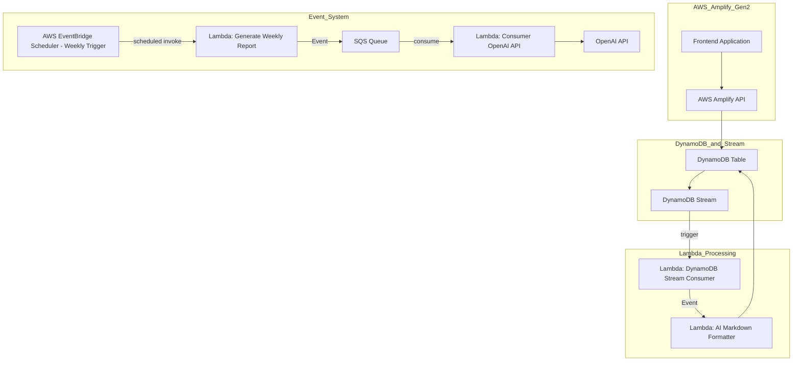

# Daylog

 - 매일 작성한 회고를 기반으로 AI가 내용을 정리해줍니다.
 - 정리는 주간으로 진행되며 주간 회고록을 만들어 평가가 이루어집니다.

## Architecture

 1. AWS Amplify Gen2는 기본 앱과 DynamoDB 테이블을 관리합니다.
 2. DynamoDB Streaming이 새로운 항목이 추가되면 Lambda를 호출하여 이벤트를 생성하고, 해당 이벤트는 Markdown 포맷으로 변환되어 AI가 읽기 쉽게 최적화된 별도의 DynamoDB 테이블에 저장됩니다.
 3. EventBridge 스케줄러는 주간으로 Lambda를 실행하며, 실행된 Lambda는 이벤트를 생성하여 SQS로 메시지를 보냅니다. 이를 받아 처리하는 Lambda가 OpenAI API를 호출하여 주간 회고록을 생성합니다.

## Docs

 - [Database Schema](./docs/database-schema.md)
 - [System Design](./docs/system-design.md)
