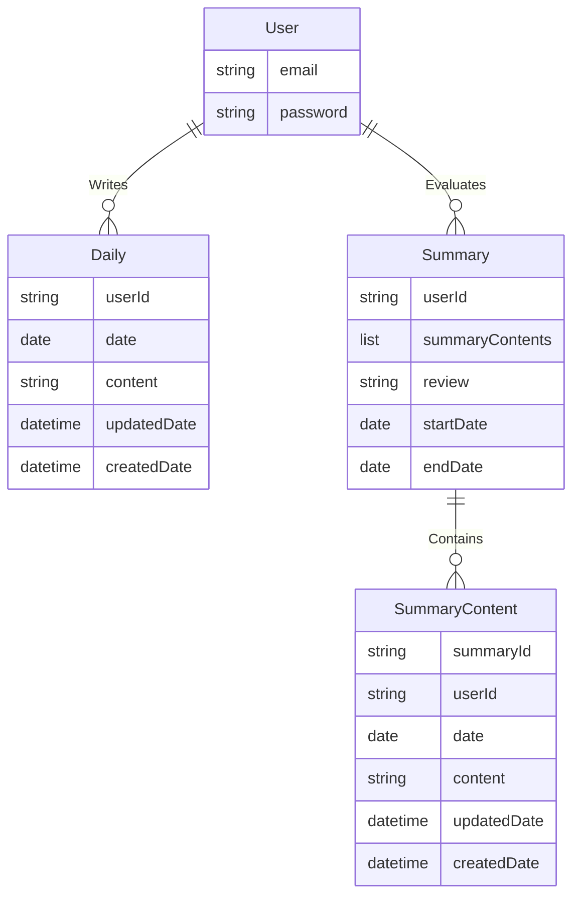
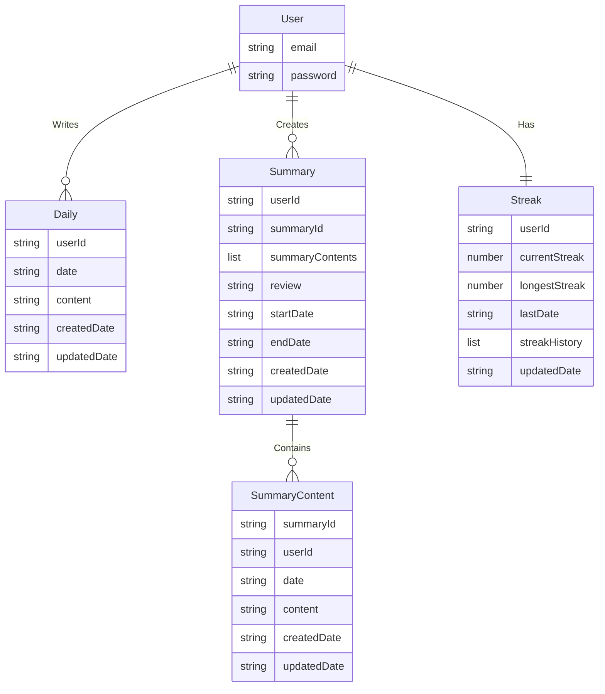

# DynamoDB 스키마 설계

## ERD



### 🎯 Access pattern

| Entity           | Method                  | Description                    |
| ---------------- | ----------------------- | ------------------------------ |
| `Daily`          | findByUserIdAndDate     | 특정 회고 조회                 |
| `Daily`          | findByUserIdBetweenDate | 사용자 회고를 월별로 조회      |
| `Daily`          | findByDate              | 일별 회고 목록 조회            |
| `Summary`        | findByUserId            | 사용자 별로 집계하기 위한 조회 |
| `SummaryContent` | findBySummaryId         | 특정 요약의 세부 내용 조회     |

## 테이블 구조

Daylog 애플리케이션은 다음과 같은 DynamoDB 테이블 구조를 사용합니다:

### Daily 테이블

사용자의 일일 회고를 저장하는 테이블입니다.

| 속성        | 유형   | 설명                                 |
| ----------- | ------ | ------------------------------------ |
| userId      | String | 파티션 키 - 사용자 ID                |
| date        | String | 정렬 키 - ISO 형식 날짜 (YYYY-MM-DD) |
| content     | String | 회고 내용                            |
| createdDate | String | 생성 일시 (ISO 형식)                 |
| updatedDate | String | 업데이트 일시 (ISO 형식)             |

#### 인덱스

1. **기본 인덱스 (Primary Key)**

   - PK: userId
   - SK: date

2. **GSI: ByDate**
   - PK: date
   - SK: userId

### Summary 테이블

주간/월간/분기별 요약을 저장하는 테이블입니다.

| 속성        | 유형   | 설명                                                      |
| ----------- | ------ | --------------------------------------------------------- |
| userId      | String | 파티션 키 - 사용자 ID                                     |
| summaryId   | String | 정렬 키 - 요약 ID (예: "W#2023#01", "M#2023#01", "Q#2023#1") |
| review      | String | 종합 리뷰                                                 |
| startDate   | String | 시작 날짜 (YYYY-MM-DD)                                    |
| endDate     | String | 종료 날짜 (YYYY-MM-DD)                                    |
| createdDate | String | 생성 일시                                                 |
| updatedDate | String | 업데이트 일시                                             |

#### 인덱스

1. **기본 인덱스 (Primary Key)**

   - PK: userId
   - SK: summaryId

2. **GSI: ByDateRange**
   - PK: startDate
   - SK: userId

### SummaryContent 테이블

요약의 세부 내용을 저장하는 테이블입니다.

| 속성        | 유형   | 설명                       |
| ----------- | ------ | -------------------------- |
| summaryId   | String | 파티션 키 - 요약 ID        |
| userId      | String | 정렬 키 - 사용자 ID        |
| date        | String | ISO 형식 날짜 (YYYY-MM-DD) |
| content     | String | 세부 내용                  |
| createdDate | String | 생성 일시 (ISO 형식)       |
| updatedDate | String | 업데이트 일시 (ISO 형식)   |

#### 인덱스

1. **기본 인덱스 (Primary Key)**
   - PK: summaryId
   - SK: userId

### Streak 테이블

사용자의 연속 작성 정보를 저장하는 테이블입니다.

| 속성          | 유형         | 설명                          |
| ------------- | ------------ | ----------------------------- |
| userId        | String       | 파티션 키 - 사용자 ID         |
| currentStreak | Number       | 현재 연속 작성일              |
| longestStreak | Number       | 최장 연속 작성일              |
| lastDate      | String       | 마지막 작성 날짜 (YYYY-MM-DD) |
| streakHistory | List<Number> | 최근 30일 연속 작성 기록      |
| updatedDate   | String       | 업데이트 일시                 |

## 접근 패턴

### Daily 테이블

1. **특정 사용자의 특정 날짜 회고 조회**

   ```
   Query:
     Key: { userId: "user123", date: "2023-03-15" }
   ```

2. **특정 사용자의 날짜 범위 내 회고 조회 (월별 조회 등)**

   ```
   Query:
     Key: { userId: "user123" }
     KeyConditionExpression: "userId = :userId AND date BETWEEN :startDate AND :endDate"
     ExpressionAttributeValues: {
       ":userId": "user123",
       ":startDate": "2023-03-01",
       ":endDate": "2023-03-31"
     }
   ```

3. **특정 날짜의 모든 회고 조회**
   ```
   Query on GSI (ByDate):
     IndexName: "byDate"
     Key: { date: "2023-03-15" }
   ```

### Summary 테이블

1. **특정 사용자의 모든 요약 조회**

   ```
   Query:
     Key: { userId: "user123" }
   ```

2. **특정 사용자의 특정 요약 조회**

   ```
   Query:
     Key: { userId: "user123", summaryId: "2023-Q1" }
   ```

3. **특정 기간의 모든 요약 조회**
   ```
   Query on GSI (ByDateRange):
     IndexName: "byDateRange"
     Key: { startDate: "2023-01-01" }
   ```

### SummaryContent 테이블

1. **특정 요약의 세부 내용 조회**
   ```
   Query:
     Key: { summaryId: "2023-Q1", userId: "user123" }
   ```

### Streak 테이블

1. **사용자의 연속 작성 정보 조회**
   ```
   GetItem:
     Key: { userId: "user123" }
   ```

## 데이터 모델링 다이어그램


