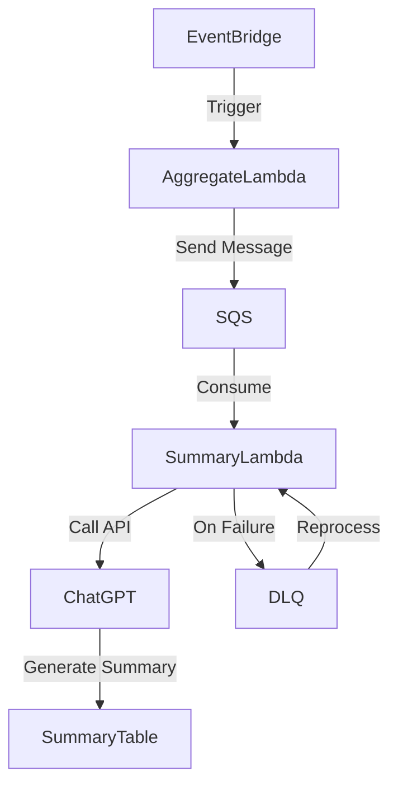

# 시스템 아키텍처

## 1. 개요
본 문서는 주간 사용자 회고록(Summary) 자동 생성 기능을 구현하기 위한 시스템 아키텍처를 정의합니다. 해당 기능은 AWS EventBridge, SQS, Lambda를 활용하여 이벤트 기반의 비동기 처리를 수행하며, 자동 재시도 및 트래픽 조절이 가능하도록 설계되었습니다.

## 2. 아키텍처 개요
### 2.1. 시스템 구성 요소
- **AWS EventBridge**: 주간 회고록 요약 요청을 트리거하고, SQS에 이벤트를 전달합니다.
- **AWS SQS (Simple Queue Service)**: 트래픽 조절 및 실패한 요청을 처리하기 위한 메시지 큐 역할을 합니다.
- **AWS Lambda**:
  - `Aggregate Lambda`: EventBridge에서 트리거되어 사용자별 요약 이벤트를 SQS에 전송합니다.
  - `Summary Lambda`: SQS에서 이벤트를 받아 ChatGPT API 요청을 수행하고, 회고록을 저장합니다.
- **AWS Dead Letter Queue (DLQ)**: 실패한 이벤트를 저장하고 재처리할 수 있도록 합니다.

### 2.2. 데이터 흐름
1. **EventBridge**가 매주 `Aggregate Lambda`를 트리거합니다.
2. `Aggregate Lambda`는 사용자별 `events.summary` 이벤트를 **SQS**에 게시합니다.
3. `Summary Lambda`는 SQS에서 메시지를 읽고 **ChatGPT API**를 호출하여 회고록을 요약합니다.
4. 결과를 **Summary 테이블(DynamoDB 또는 RDS)**에 저장합니다.
5. 실패한 요청은 **SQS DLQ**로 저장되어 나중에 재처리됩니다.

### 2.3. 아키텍처 다이어그램 (Mermaid)

## 3. 재시도 및 장애 대응
### 3.1. EventBridge의 기본 재시도
- 기본적으로 2회 재시도 (1분 후, 2분 후) 수행.
- `RetryPolicy` 설정을 통해 최대 5회까지 증가 가능.

### 3.2. SQS의 자동 트래픽 조절 및 재시도
- Lambda의 **동시 실행 제한 (Concurrency Limit)**을 조정하여 요청 폭주를 방지.
- SQS의 **Visibility Timeout**을 설정하여 실패한 요청을 자동으로 재처리 가능.
- **Batch Size 설정**을 통해 여러 개의 요청을 묶어서 처리하여 API Rate Limit 완화 가능.

### 3.3. DLQ(Dead Letter Queue) 활용
- 실패한 이벤트를 **DLQ(SQS)**에 저장하여 데이터 손실을 방지.
- DLQ에 저장된 이벤트는 별도의 Lambda에서 주기적으로 재처리.

## 4. 최적화 및 확장 고려 사항
- API Rate Limit 문제를 방지하기 위해 **Batch API 요청**을 고려.
- **Step Functions**을 활용하면 다단계 재시도 및 워크플로우 관리 가능.
- **CloudWatch Metrics**와 **X-Ray 트레이싱**을 적용하여 성능 모니터링.

## 5. 결론
본 아키텍처는 **EventBridge → SQS → Lambda** 기반으로 구성되어 있으며, **비동기 이벤트 처리, 트래픽 조절, 자동 재시도 및 장애 대응**을 효과적으로 수행할 수 있습니다. 향후 사용량 증가에 따라 추가적인 확장 전략을 적용할 수 있습니다.

