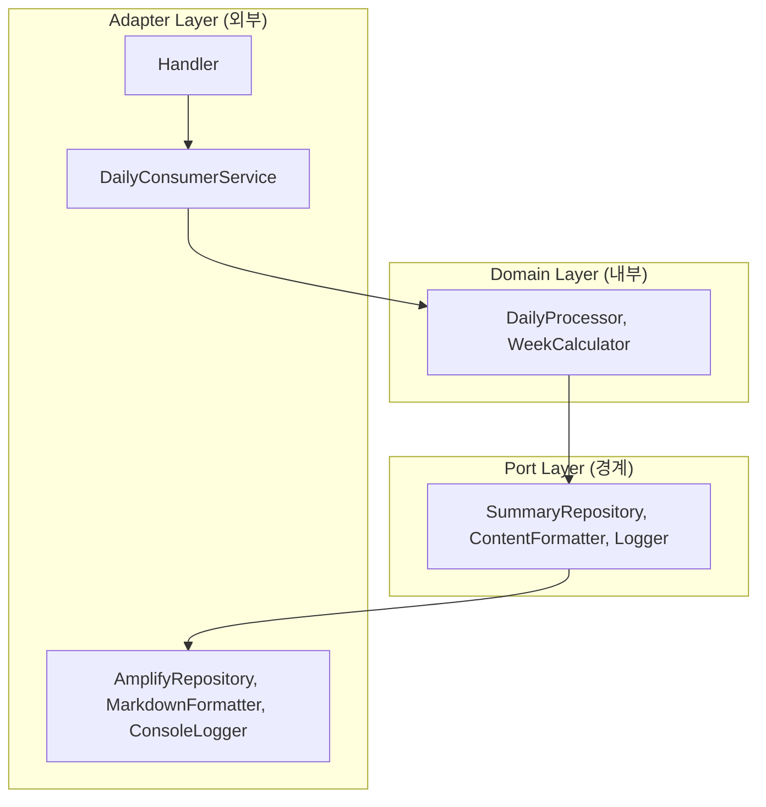

# Daily Consumer 리팩토링 계획

## Hexagonal 아키텍처 적용 계획

Hexagonal 아키텍처(포트와 어댑터 패턴)를 적용하여 `amplify/functions/daily-consumer/handler.ts` 파일을 리팩토링합니다. 이 아키텍처는 다음 세 가지 주요 레이어로 구성됩니다:

1. **Domain (도메인)**: 핵심 비즈니스 로직과 엔티티
2. **Port (포트)**: 도메인과 외부 세계를 연결하는 인터페이스
3. **Adapter (어댑터)**: 포트 인터페이스의 구체적인 구현체



## 디렉토리 구조

```
amplify/functions/daily-consumer/
├── handler.ts                     # 진입점
├── domain/                        # 도메인 레이어
│   ├── daily-processor.ts         # 일일 회고 처리 로직
│   ├── week-calculator.ts         # 주차 계산 로직
│   └── types.ts                   # 도메인 타입 정의
├── port/                          # 포트 레이어 (인터페이스)
│   ├── summary-repository.ts      # 요약 데이터 저장소 인터페이스
│   ├── content-formatter.ts       # 콘텐츠 포맷 변환 인터페이스
│   └── logger.ts                  # 로깅 인터페이스
└── adapter/                       # 어댑터 레이어 (구현체)
    ├── daily-consumer-service.ts  # 이벤트 처리 서비스
    ├── amplify-repository.ts      # Amplify 기반 저장소 구현
    ├── markdown-formatter.ts      # Markdown 변환 구현
    └── console-logger.ts          # 로깅 구현
```

## 상세 구현 계획

### 1. Domain Layer (도메인 레이어)

도메인 레이어는 비즈니스 로직의 핵심이며, 외부 의존성 없이 순수한 비즈니스 규칙만 포함합니다.

#### domain/types.ts
```typescript
// 도메인 타입 정의
export interface DailyEntry {
  userId: string;
  date: string;
  content: string;
}

export interface WeekSummary {
  userId: string;
  summaryId: string;
  review: string;
  startDate: string;
  endDate: string;
}

export interface DailyContent {
  userId: string;
  summaryId: string;
  date: string;
  content: string;
}

export interface WeekInfo {
  summaryId: string;
  startDate: Date;
  endDate: Date;
}
```

#### domain/week-calculator.ts
```typescript
// 주차 계산 로직
import { WeekInfo } from './types';
import { format, getISOWeek, getISOWeekYear } from 'date-fns';

export class WeekCalculator {
  /**
   * 주어진 날짜로부터 주 정보 계산
   */
  calculateWeekInfo(date: Date): WeekInfo {
    const isoYear = String(getISOWeekYear(date));
    const isoWeek = String(getISOWeek(date)).padStart(2, '0');
    const summaryId = `W#${isoYear}#${isoWeek}`;
    
    const startDate = this.calculateWeekStartDate(date);
    const endDate = this.calculateWeekEndDate(startDate);
    
    return {
      summaryId,
      startDate,
      endDate
    };
  }
  
  private calculateWeekStartDate(date: Date): Date {
    const startDate = new Date(date);
    const day = startDate.getDay();
    startDate.setDate(startDate.getDate() - (day === 0 ? 6 : day - 1));
    return startDate;
  }
  
  private calculateWeekEndDate(startDate: Date): Date {
    const endDate = new Date(startDate);
    endDate.setDate(endDate.getDate() + 6);
    return endDate;
  }
}
```

#### domain/daily-processor.ts
```typescript
// 일일 회고 처리 핵심 로직
import { DailyEntry, WeekInfo } from './types';
import { WeekCalculator } from './week-calculator';
import { SummaryRepository } from '../port/summary-repository';
import { ContentFormatter } from '../port/content-formatter';
import { Logger } from '../port/logger';

export class DailyProcessor {
  constructor(
    private weekCalculator: WeekCalculator,
    private summaryRepository: SummaryRepository,
    private contentFormatter: ContentFormatter,
    private logger: Logger
  ) {}
  
  /**
   * 일일 회고 처리 핵심 로직
   */
  async processDailyEntry(entry: DailyEntry): Promise<void> {
    // 1. 날짜 정보 계산
    const date = new Date(entry.date);
    const weekInfo = this.weekCalculator.calculateWeekInfo(date);
    
    // 2. 주간 요약 조회 및 필요시 생성
    await this.ensureWeekSummaryExists(entry.userId, weekInfo);
    
    // 3. 일일 콘텐츠 처리
    const formattedContent = this.contentFormatter.format(entry.content);
    await this.processDailyContent(entry.userId, weekInfo.summaryId, entry.date, formattedContent);
  }
  
  private async ensureWeekSummaryExists(userId: string, weekInfo: WeekInfo): Promise<void> {
    const summary = await this.summaryRepository.findWeekSummary(userId, weekInfo.summaryId);
    
    if (!summary) {
      const startDateStr = this.formatDate(weekInfo.startDate);
      const endDateStr = this.formatDate(weekInfo.endDate);
      
      await this.summaryRepository.createWeekSummary({
        userId,
        summaryId: weekInfo.summaryId,
        review: '',
        startDate: startDateStr,
        endDate: endDateStr
      });
      
      this.logger.info('Created new week summary', {
        userId,
        summaryId: weekInfo.summaryId,
        startDate: startDateStr,
        endDate: endDateStr
      });
    }
  }
  
  private async processDailyContent(
    userId: string, 
    summaryId: string, 
    date: string, 
    content: string
  ): Promise<void> {
    const existingContent = await this.summaryRepository.findDailyContent(userId, summaryId, date);
    
    if (existingContent) {
      await this.summaryRepository.updateDailyContent({
        userId,
        summaryId,
        date,
        content
      });
      
      this.logger.info('Updated daily content', { userId, summaryId, date });
    } else {
      await this.summaryRepository.createDailyContent({
        userId,
        summaryId,
        date,
        content
      });
      
      this.logger.info('Created new daily content', { userId, summaryId, date });
    }
  }
  
  private formatDate(date: Date): string {
    return date.toISOString().split('T')[0]; // YYYY-MM-DD 형식
  }
}
```

### 2. Port Layer (포트 레이어)

포트 레이어는 도메인과 외부 세계 사이의 인터페이스를 정의합니다.

#### port/summary-repository.ts
```typescript
// 요약 데이터 저장소 인터페이스
import { WeekSummary, DailyContent } from '../domain/types';

export interface SummaryRepository {
  findWeekSummary(userId: string, summaryId: string): Promise<WeekSummary | null>;
  createWeekSummary(summary: WeekSummary): Promise<void>;
  findDailyContent(userId: string, summaryId: string, date: string): Promise<DailyContent | null>;
  createDailyContent(content: DailyContent): Promise<void>;
  updateDailyContent(content: DailyContent): Promise<void>;
}
```

#### port/content-formatter.ts
```typescript
// 콘텐츠 포맷 변환 인터페이스
export interface ContentFormatter {
  format(content: string): string;
}
```

#### port/logger.ts
```typescript
// 로깅 인터페이스
export interface Logger {
  info(message: string, context?: Record<string, unknown>): void;
  error(message: string, context?: Record<string, unknown>): void;
  warn(message: string, context?: Record<string, unknown>): void;
  debug(message: string, context?: Record<string, unknown>): void;
}
```

### 3. Adapter Layer (어댑터 레이어)

어댑터 레이어는 포트 인터페이스의 구체적인 구현을 제공합니다.

#### adapter/daily-consumer-service.ts
```typescript
// 이벤트 처리 서비스
import { DailyProcessor } from '../domain/daily-processor';
import { DailyEntry } from '../domain/types';
import { Logger } from '../port/logger';

export class DailyConsumerService {
  constructor(
    private dailyProcessor: DailyProcessor,
    private logger: Logger
  ) {}
  
  /**
   * EventBridge 이벤트 처리
   */
  async processEvent(event: any): Promise<void> {
    this.logger.info('Event received', {
      id: event.id,
      detailType: event['detail-type'],
      source: event.source,
    });
    
    const payload = event.detail;
    
    if (!this.isValidPayload(payload)) {
      this.logger.error('Invalid payload', { payload });
      return;
    }
    
    await this.dailyProcessor.processDailyEntry(payload as DailyEntry);
    
    this.logger.info('Event processed', { id: event.id });
  }
  
  private isValidPayload(payload: unknown): boolean {
    if (!payload || typeof payload !== 'object') return false;
    
    return (
      'userId' in payload &&
      typeof payload.userId === 'string' &&
      'date' in payload &&
      typeof payload.date === 'string' &&
      'content' in payload &&
      typeof payload.content === 'string'
    );
  }
}
```

#### adapter/amplify-repository.ts
```typescript
// Amplify 기반 저장소 구현
import { generateClient } from 'aws-amplify/data';
import { Schema } from '../../../data/resource';
import { SummaryRepository } from '../port/summary-repository';
import { WeekSummary, DailyContent } from '../domain/types';
import { Logger } from '../port/logger';

export class AmplifyRepository implements SummaryRepository {
  constructor(
    private client: ReturnType<typeof generateClient<Schema>>,
    private logger: Logger
  ) {}
  
  async findWeekSummary(userId: string, summaryId: string): Promise<WeekSummary | null> {
    try {
      const { data, errors } = await this.client.models.Summary.get({
        userId,
        summaryId,
      });
      
      if (errors) {
        this.logger.error('Failed to fetch summary', { userId, summaryId, errors });
        throw new Error('Failed to fetch summary');
      }
      
      return data ? {
        userId: data.userId,
        summaryId: data.summaryId,
        review: data.review || '',
        startDate: data.startDate,
        endDate: data.endDate
      } : null;
    } catch (error) {
      this.logger.error('Error fetching summary', { userId, summaryId, error });
      throw error;
    }
  }
  
  async createWeekSummary(summary: WeekSummary): Promise<void> {
    try {
      const { errors } = await this.client.models.Summary.create(summary);
      
      if (errors) {
        this.logger.error('Failed to create summary', { summary, errors });
        throw new Error('Failed to create summary');
      }
    } catch (error) {
      this.logger.error('Error creating summary', { summary, error });
      throw error;
    }
  }
  
  async findDailyContent(userId: string, summaryId: string, date: string): Promise<DailyContent | null> {
    try {
      const { data, errors } = await this.client.models.SummaryContent.get({
        userId,
        summaryId,
        date,
      });
      
      if (errors) {
        this.logger.error('Failed to fetch daily content', { userId, summaryId, date, errors });
        throw new Error('Failed to fetch daily content');
      }
      
      return data ? {
        userId: data.userId,
        summaryId: data.summaryId,
        date: data.date,
        content: data.content || ''
      } : null;
    } catch (error) {
      this.logger.error('Error fetching daily content', { userId, summaryId, date, error });
      throw error;
    }
  }
  
  async createDailyContent(content: DailyContent): Promise<void> {
    try {
      const { errors } = await this.client.models.SummaryContent.create(content);
      
      if (errors) {
        this.logger.error('Failed to create daily content', { content, errors });
        throw new Error('Failed to create daily content');
      }
    } catch (error) {
      this.logger.error('Error creating daily content', { content, error });
      throw error;
    }
  }
  
  async updateDailyContent(content: DailyContent): Promise<void> {
    try {
      const { errors } = await this.client.models.SummaryContent.update(content);
      
      if (errors) {
        this.logger.error('Failed to update daily content', { content, errors });
        throw new Error('Failed to update daily content');
      }
    } catch (error) {
      this.logger.error('Error updating daily content', { content, error });
      throw error;
    }
  }
}
```

#### adapter/markdown-formatter.ts
```typescript
// Markdown 변환 구현
import Turndown from 'turndown';
import { ContentFormatter } from '../port/content-formatter';

export class MarkdownFormatter implements ContentFormatter {
  private turndown: Turndown;
  
  constructor() {
    this.turndown = new Turndown({
      headingStyle: 'atx',
      hr: '---',
      bulletListMarker: '-',
    });
  }
  
  format(content: string): string {
    return this.turndown.turndown(content);
  }
}
```

#### adapter/console-logger.ts
```typescript
// 로깅 구현
import { Logger } from '@aws-lambda-powertools/logger';
import { Logger as LoggerPort } from '../port/logger';

export class ConsoleLogger implements LoggerPort {
  private logger: Logger;
  
  constructor(serviceName: string = 'daily-consumer') {
    this.logger = new Logger({
      logLevel: 'INFO',
      serviceName,
    });
  }
  
  info(message: string, context?: Record<string, unknown>): void {
    this.logger.info(message, context || {});
  }
  
  error(message: string, context?: Record<string, unknown>): void {
    this.logger.error(message, context || {});
  }
  
  warn(message: string, context?: Record<string, unknown>): void {
    this.logger.warn(message, context || {});
  }
  
  debug(message: string, context?: Record<string, unknown>): void {
    this.logger.debug(message, context || {});
  }
}
```

### 4. Handler (진입점)

#### handler.ts
```typescript
// Lambda 핸들러
import { EventBridgeHandler } from 'aws-lambda';
import { Amplify } from 'aws-amplify';
import { generateClient } from 'aws-amplify/data';
import { getAmplifyDataClientConfig } from '@aws-amplify/backend/function/runtime';
import { env } from '$amplify/env/daily-consumer';
import type { Schema } from '../../data/resource';

// 도메인
import { WeekCalculator } from './domain/week-calculator';
import { DailyProcessor } from './domain/daily-processor';

// 어댑터
import { ConsoleLogger } from './adapter/console-logger';
import { AmplifyRepository } from './adapter/amplify-repository';
import { MarkdownFormatter } from './adapter/markdown-formatter';
import { DailyConsumerService } from './adapter/daily-consumer-service';

// 설정 및 클라이언트 초기화
const { resourceConfig, libraryOptions } = await getAmplifyDataClientConfig(env);
Amplify.configure(resourceConfig, libraryOptions);

// 어댑터 초기화
const logger = new ConsoleLogger();
const client = generateClient<Schema>();
const repository = new AmplifyRepository(client, logger);
const formatter = new MarkdownFormatter();

// 도메인 서비스 초기화
const weekCalculator = new WeekCalculator();
const dailyProcessor = new DailyProcessor(
  weekCalculator,
  repository,
  formatter,
  logger
);

// 애플리케이션 서비스 초기화
const dailyConsumerService = new DailyConsumerService(dailyProcessor, logger);

// Lambda 핸들러
export const handler: EventBridgeHandler<'Scheduled Event', unknown, void> = async (event) => {
  try {
    await dailyConsumerService.processEvent(event);
  } catch (error) {
    logger.error('Unhandled error in handler', { error });
    throw error;
  }
};
```

## 리팩토링의 이점

1. **비즈니스 로직 분리**: 핵심 비즈니스 로직이 외부 의존성으로부터 격리되어 순수하게 유지됩니다.
2. **단순성 유지**: 각 컴포넌트가 단일 책임을 가지며, 비즈니스 도메인과 관련된 명확한 이름을 사용합니다.
3. **테스트 용이성**: 각 컴포넌트를 독립적으로 테스트할 수 있습니다.
4. **유연성**: 구현체를 교체하여 다른 기술로 쉽게 전환할 수 있습니다.
5. **가독성**: 코드의 의도와 구조가 명확해집니다.
6. **재사용성**: 도메인 로직과 어댑터를 다른 Lambda 함수에서 재사용할 수 있습니다.