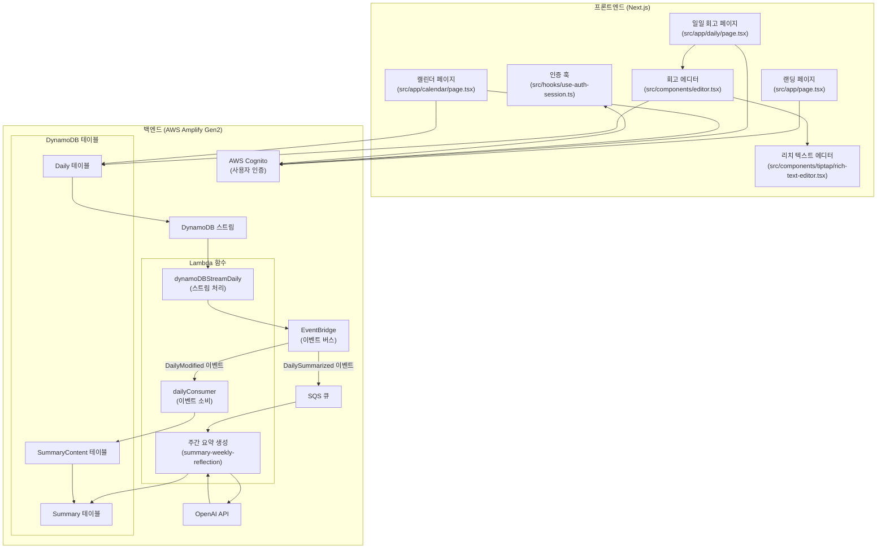

# 프로젝트 진행 상황

## 현재 개발 단계
- 초기 개발 단계
- 기본 아키텍처 및 데이터베이스 스키마 설계 완료
- 프론트엔드 구현 및 백엔드 통합 진행 중

## 완료된 작업
- 프로젝트 기본 구조 설정 (Next.js, AWS Amplify Gen2)
- 데이터베이스 스키마 설계
- 시스템 아키텍처 설계
- 기본 문서화 (README.md, database-schema.md, system-design.md)
- 랜딩 페이지 구현
- 일일 회고 에디터 구현
- 캘린더 뷰 구현
- 사용자 인증 시스템 구현
- DynamoDB 스트림 및 이벤트 처리 구현
- summary-weekly-reflection Lambda 함수 구현 (주간 회고 AI 요약)

## 진행 중인 작업
- 주간 요약 생성 기능 개발
- 연속 작성 기록(Streak) 시스템 구현
- UI/UX 개선

## 다음 개발 단계
- AI 요약 기능 고도화
- 모바일 최적화
- 사용자 피드백 시스템 구현
- 데이터 분석 및 인사이트 기능 개발

## 시스템 아키텍처 다이어그램

## 마일스톤
| 마일스톤 | 예상 완료일 | 상태 |
|---------|------------|------|
| 기본 아키텍처 설계 | 완료 | ✅ |
| 데이터베이스 스키마 설계 | 완료 | ✅ |
| 사용자 인증 시스템 | 완료 | ✅ |
| 일일 회고 기능 | 완료 | ✅ |
| 캘린더 뷰 | 완료 | ✅ |
| 이벤트 처리 시스템 | 완료 | ✅ |
| AI 요약 기능 | 진행 중 | 🔄 |
| 연속 작성 기록 시스템 | 진행 중 | 🔄 |
| 모바일 최적화 | 예정 | ⏳ |
| 사용자 피드백 시스템 | 예정 | ⏳ |
| 데이터 분석 및 인사이트 | 예정 | ⏳ |
| 베타 테스트 | 예정 | ⏳ |
| 정식 출시 | 예정 | ⏳ |

## 현재 이슈 및 블로커
- OpenAI API 통합 및 비용 관리 전략 필요
- 모바일 환경에서의 에디터 사용성 개선 필요

## 리소스 및 의존성
- AWS 계정 및 서비스 설정
- OpenAI API 키 및 사용량 관리
- 개발 인력 및 일정 관리