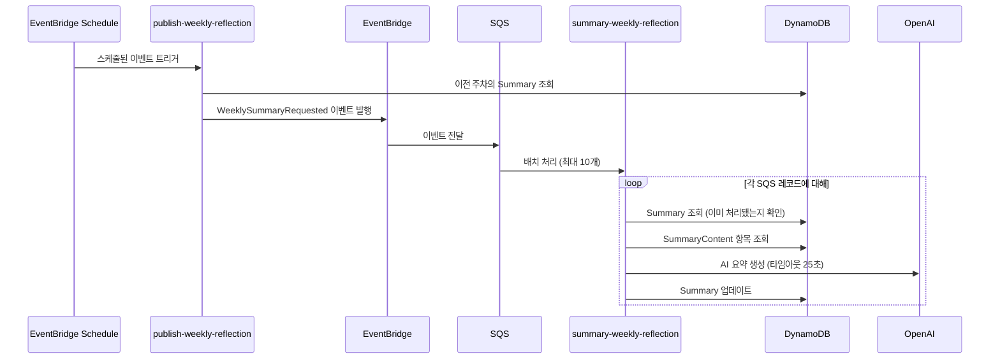
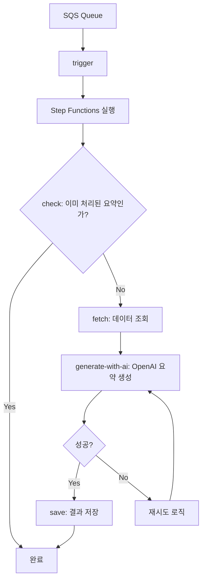

# Lambda 함수의 Step Functions 리팩토링 계획

## 현재 시스템 흐름

## 현재 구조의 문제점

1. **단일 Lambda 함수에 모든 로직 집중**: 모든 처리 과정이 하나의 Lambda 함수에 집중되어 있어 복잡성이 높고 유지보수가 어렵습니다.

2. **불필요한 조회 처리**: 각 레코드마다 Summary와 SummaryContent를 개별적으로 조회하여 데이터베이스 부하가 증가합니다.

3. **비효율적인 OpenAI API 호출 처리**:
   - 단순한 타임아웃 처리 (25초 후 실패)
   - 실패 시 효율적인 재시도 메커니즘 부재
   - 병렬 처리 불가능

4. **제한된 Lambda 실행 시간**: Lambda 함수의 타임아웃이 30초로 설정되어 있어 OpenAI API 호출이 지연될 경우 처리가 중단됩니다.

## Step Functions 리팩토링 계획

### 1. 아키텍처 개선 방안

### 2. 세부 구현 계획

#### 2.1. Step Functions 워크플로우 정의

1. **trigger**:
   - SQS 이벤트를 받아 Step Functions 워크플로우 시작
   - 각 레코드를 개별 실행으로 처리하여 병렬성 확보

2. **check**:
   - 이미 처리된 요약인지 확인
   - 처리된 경우 워크플로우 종료

3. **fetch**:
   - Summary 및 SummaryContent 데이터 조회
   - 데이터 캐싱 전략 적용하여 중복 조회 최소화

4. **generate-with-ai**:
   - OpenAI API 호출하여 요약 생성
   - 재시도 정책 구현 (지수 백오프 전략)
   - 타임아웃 처리 개선

5. **save**:
   - 생성된 요약을 DynamoDB에 저장

#### 2.2. Lambda 함수 분리

1. **summary-weekly-reflection-trigger**:
   - SQS 이벤트 처리 및 Step Functions 실행
   - 간단한 변환 로직만 포함

2. **summary-weekly-reflection-check**:
   - Summary 테이블 조회하여 이미 처리된 요약인지 확인

3. **summary-weekly-reflection-fetch**:
   - SummaryContent 항목 조회
   - 데이터 전처리 및 포맷팅

4. **summary-weekly-reflection-generate-with-ai**:
   - OpenAI API 호출
   - 요약 생성 로직

5. **summary-weekly-reflection-save**:
   - 생성된 요약을 Summary 테이블에 업데이트

#### 2.3. 재시도 및 오류 처리 전략

1. **OpenAI API 호출 재시도 정책**:
   - 지수 백오프 전략 적용 (초기 지연: 2초, 최대 지연: 60초)
   - 최대 재시도 횟수: 3회
   - 재시도 가능한 오류와 불가능한 오류 구분

2. **Step Functions 상태 관리**:
   - 각 단계의 성공/실패 상태 추적
   - 실패 시 적절한 오류 처리 및 알림

3. **DLQ(Dead Letter Queue) 활용**:
   - 지속적으로 실패하는 작업을 DLQ로 이동
   - 모니터링 및 수동 개입 가능하도록 설계

### 3. 구현 단계

#### 3.1. 인프라 구성

1. **Step Functions 워크플로우 정의**:
   - AWS CDK 또는 CloudFormation을 사용하여 워크플로우 정의
   - 상태 전환 및 오류 처리 로직 구현

2. **Lambda 함수 생성**:
   - 각 단계별 Lambda 함수 구현
   - IAM 역할 및 권한 설정

3. **SQS 및 DLQ 구성**:
   - 메인 큐와 DLQ 설정
   - 가시성 타임아웃 및 재드라이브 정책 구성

#### 3.2. 코드 리팩토링

1. **공통 코드 모듈화**:
   - 데이터 액세스 로직
   - 로깅 및 오류 처리
   - OpenAI API 클라이언트

2. **Lambda 함수 구현**:
   - 각 단계별 로직 분리
   - 입/출력 형식 표준화

3. **테스트 코드 작성**:
   - 단위 테스트
   - 통합 테스트
   - 로컬 실행 환경 구성

## 기대 효과

1. **확장성 향상**:
   - 각 단계를 독립적으로 확장 가능
   - 병렬 처리를 통한 처리량 증가

2. **안정성 개선**:
   - 효율적인 재시도 메커니즘
   - 명확한 오류 처리 및 모니터링

3. **유지보수성 강화**:
   - 관심사 분리를 통한 코드 복잡성 감소
   - 각 단계별 독립적인 테스트 및 배포 가능

4. **비용 최적화**:
   - 불필요한 데이터베이스 조회 감소
   - Lambda 실행 시간 최적화

5. **모니터링 및 디버깅 용이성**:
   - Step Functions 시각적 워크플로우를 통한 실행 상태 확인
   - 각 단계별 상세 로깅 및 지표 수집